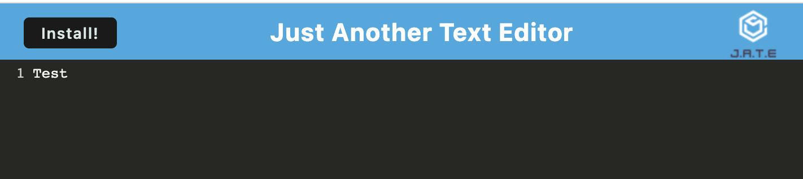

# Text Editor

## Description

A text editor that runs in the browser and will also function offline. The app will be a single-page application that meets the PWA criteria. Additionally, it will feature a number of data persistence techniques that serve as redundancy in case one of the options is not supported by the browser.

## Usage

App: https://text-editor-ah19.herokuapp.com/

The following image shows the application's appearance and functionality:

## Contact

GitHub: [an-n-ie](https://github.com/an-n-ie)

Email: anniehoang.anh@gmail.com

